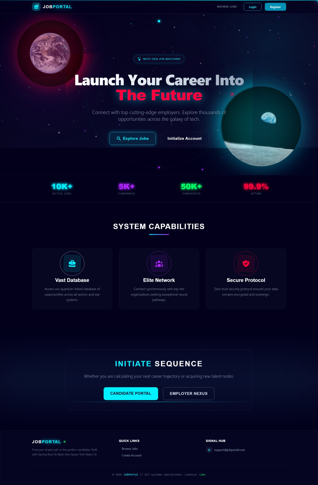

# 🚀 Job Portal

A modern, full-stack Job Portal web application built with **Spring Boot** (Backend) and **React + Vite** (Frontend). 



## ✨ Features
- **Role-Based Access Control**: Separate portals for Candidates, Employers, and Admins.
- **Candidate Features**: Browse jobs, apply to positions, manage profile, and save favorite jobs.
- **Employer Features**: Post new jobs, manage job listings, review applications.
- **Admin Dashboard**: System oversight and user management.
- **Modern UI**: Fully responsive, sleek holographic/space-themed interface built with Tailwind CSS.
- **Secure Authentication**: JWT-based authentication via Spring Security.

## 🛠️ Tech Stack

### Frontend
- **Framework**: React 19 
- **Build Tool**: Vite
- **Styling**: Tailwind CSS, PostCSS
- **Routing**: React Router DOM
- **HTTP Client**: Axios
- **Icons**: React Icons

### Backend
- **Framework**: Spring Boot (Java 17+)
- **Security**: Spring Security + JWT
- **Build Tool**: Maven

## 📂 Project Structure

- `src/main/java` - Backend Java source code (Controllers, Services, Repositories, Entities)
- `src/main/resources` - Spring Boot configurations and static assets
- `job-portal-frontend/` - Modern React frontend application

## ⚙️ Prerequisites

Ensure you have the following installed before getting started:
- Java 17+
- Maven
- Node.js (v18+) & npm

## 🚀 Getting Started

### 1. Run the Backend

Navigate to the root directory and start the Spring Boot application:

```bash
./mvnw spring-boot:run
```
*The backend API will run on `http://localhost:8080`.*

### 2. Run the Frontend

Open a new terminal, navigate to the frontend directory, install dependencies, and start the development server:

```bash
cd job-portal-frontend
npm install
npm run dev
```
*The frontend application will be available at `http://localhost:5173`.*

## 🧪 Running Tests

To execute the backend unit and integration tests:

```bash
./mvnw test
```
